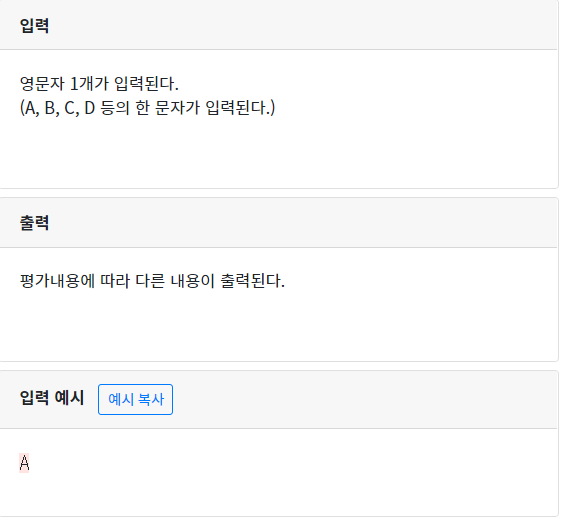

## 1069 평가 입력받아 다르게 출력하기

```python
num=input()

if num =="A":
  print("best!!!")
elif num =="B":
  print("good!!")
elif num =="C":
  print("run!")
elif num =="D":
  print("slowly~")
else:
  print("what?")

```

