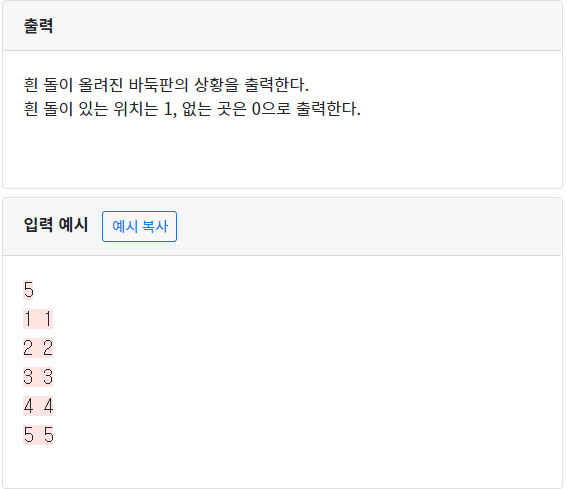
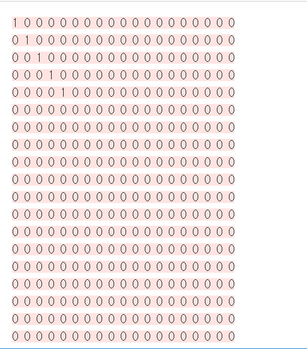

## 1096  바둑판에 흰 돌 놓기

```python
count=int(input())
baduck=[[0 for _ in range(19)] for _ in range(19)]
for i in range(count):
  x,y = map(int,input().split())
  baduck[x-1][y-1] = 1
for j in range(19):
  print(*baduck[j])
```

