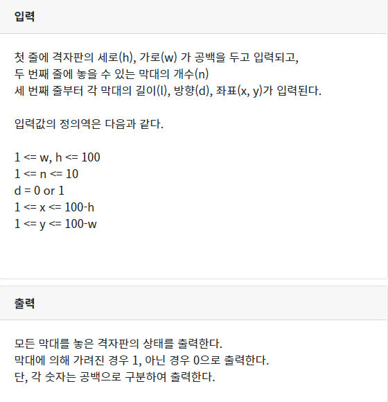

## 1099  성실한 개미

```python
box=[]
for i in range(10):
  box.append(list(map(int,input().split())))
x,y=1,1
while True:
  if box[x][y]==0:
    box[x][y]=9
    if box[x][y+1] ==0:
      y +=1
    elif box[x][y+1] ==1 and box[x+1][y] !=1:
      x+=1
    elif box[x][y+1]==2:
      box[x][y+1] =9
      break
    elif box[x+1][y]==2:
      box[x+1][y] =9
      break
  elif box[x][y] ==2:
    box[x][y]=9
    break
  else:
    break
    

for i in range(10):
  print(*box[i])
```

