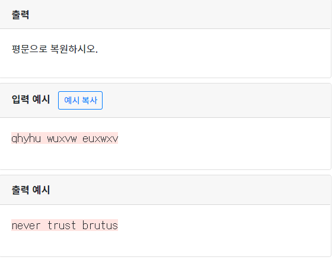

## 1294  씨저의 암호 2

```python
num=input().split()
secret_num=[]
for i in range(len(num)):
  secret=''
  for j in num[i]:
    if j=='x':   #숫자 치환시 기호로 넘어가 버리는 부분만 수정
      secret+='a'
    elif j=='y':
      secret+='b'
    elif j=='z':
      secret+='c'
    else:
      secret += chr(ord(j)+3)
    
  secret_num.append(secret)
print(*secret_num)
```

