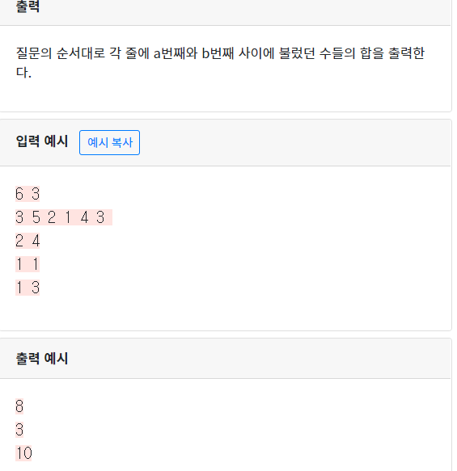

## 3007 : 기억력 테스트 7 

```python
l,m=map(int,input().split())
n=list(map(int,input().split()))
dp=[0]
dp2=[0 for _ in range(l)]
for i in range(len(n)):
  dp2[i] = dp2[i-1]+ n[i]
dp.extend(dp2)
for j in range(m):
 start_num,last_num=map(int,input().split())
 print(dp[last_num]-dp[start_num-1])
    
#이중 for 문을 돌리게되면 Sum 연산으로 시간초과가 나게됨
#0으로 된 dp list에 누적합을 구함, 맨 앞에 0을 추가해 오류가 안나게함
```

