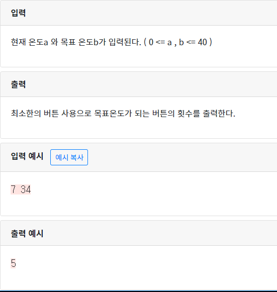

## 3120  리모컨

```python
a,b=map(int,input().split())
a,b=min(a,b),max(a,b)  #입력 숫자 크기가 바뀌어 입력되는 것 고려
print(a,b)
temp=[1,5,10] #따로 리스트 작성
count=1 #마지막 횟수를 1 추가해줌
for i in sorted(temp,reverse=True): #큰값부터
  while True:
    a+=i    #반복문으로 큰값부터 더해줌
    if a-1==b:  #1을 빼주는 것으로 최소한의 횟수를 출력할 수 있음
      a=a-1
      count+=1
      break
    elif a-2==b: #2까지로 출력할 수 있음
      a=a-2
      count+=2
      break
    elif a>b: #a가 더 크게되면 그 전상태로 롤백
      a=a-i
      count-=1 #카운팅도 1 줄여줌
      break
    count+=1  #반복이 한번 끝날때 마다 횟수 +1
    print(a)
    
print(count)
```

