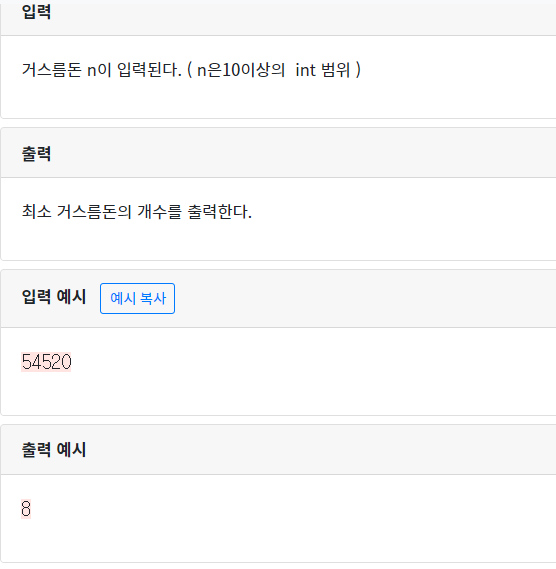

## 3301  거스름돈

```python
won = [50000,10000,5000,1000,500,100,50,10] #지불할 동전값
num=int(input())
count=0 #횟수 더해줌
for i in won:
  while True:
    if num>0: 
      num-=i	#0보다 큰값이면 더해준 값을 다시 빼줌
      count+=1 	#횟수 더해줌
    elif num==0: #0이면 그대로 종료
      break
    else:
      num+=i #작은값이면 더해줌
      count-=1 #횟수는 다시 빼줌
      break
print(count)
```

